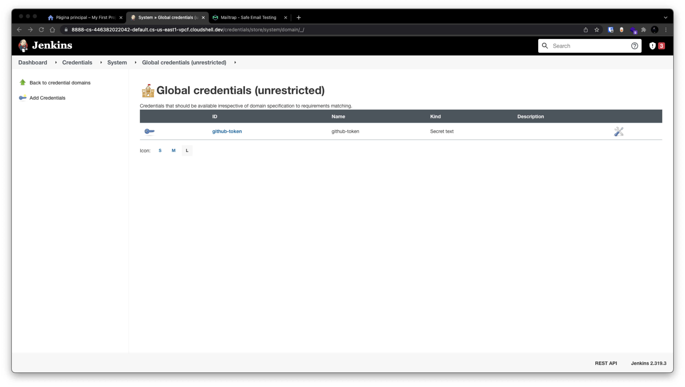
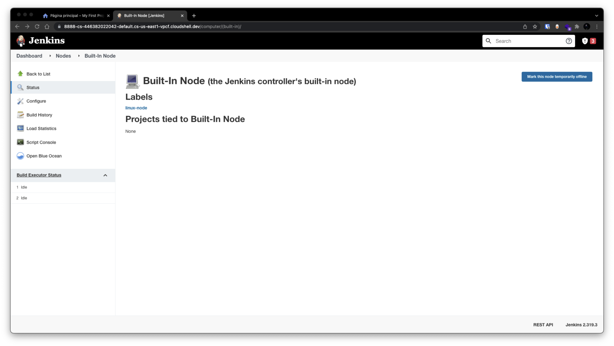
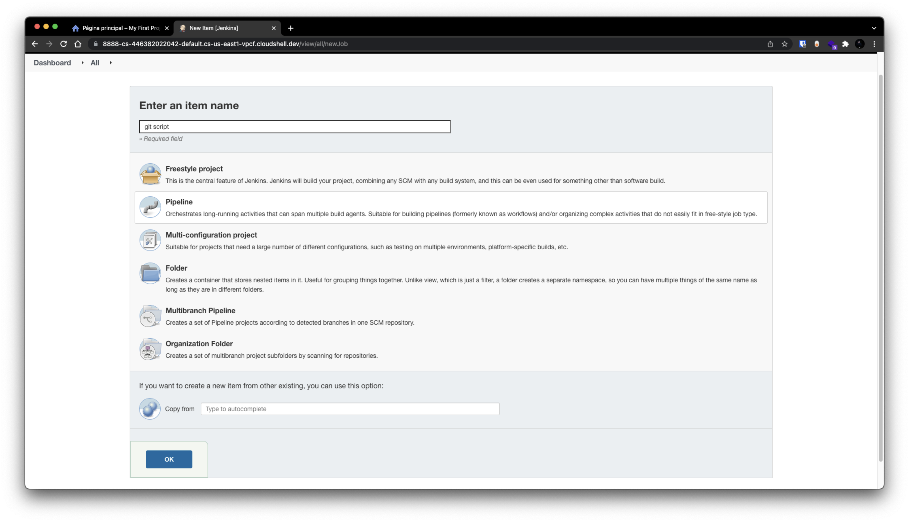
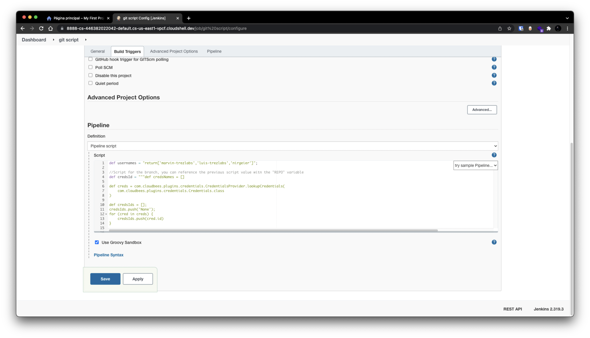
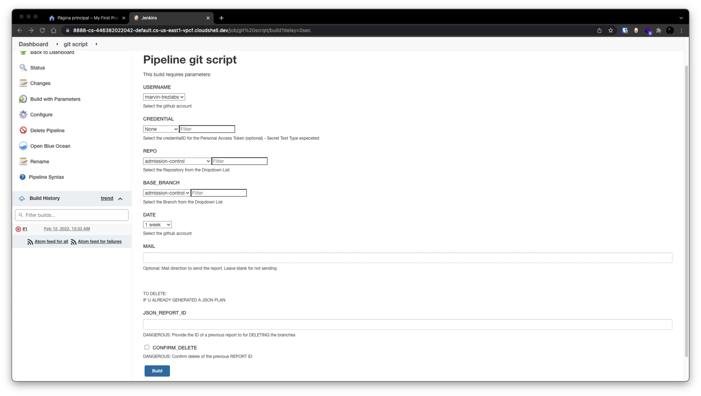

# branches-automation


## **Jenkins job:**
---

## Requisites:
- Python3
- Plugins:
  - Active choices, git, cloudbees credentials
- Nodes:
  - Will run on node with label 'linux-node', you can config that on Jenkinsfile
- Workspace:
  - The branch cleaner runs in the 'workspace/branch-cleaner' custom workspace
- Configurations:
  - Github Token credentials
  - SMTP for mails

```
⠀⠀⠀⠀⠀⠀⠀⠀⠀⠀⠀⠀⠀⠀⠀⠀⠀⠀⢠⣴⣶⣀⣀⣶⣄⠀⠀⠀⠀⠀⠀
⠀⠀⠀⠀⠀⠀⠀⢀⡠⣔⠮⠍⠛⠒⠒⠒⠚⠠⠽⣉⠙⠻⢿⣿⣿⣷⠀⠀⠀⠀⠀
⠀⠀⠀⠀⠀⣠⡂⠕⠉⠀⠀⠀⠀⠀⠀⠀⠀⠀⠀⠀⠁⠢⢀⡹⠛⠋⠑⡄⠀⠀⠀
⠀⣀⣀⣠⣼⠏⠀⠀⠀⠀⠀⠀⠀⠜⠑⣄⠀⠀⠀⠀⠀⠠⠊⠀⠀⠀⠀⣷⠀⠀⠀
⣿⣿⣿⣿⡏⠀⠀⠀⢸⠉⢆⠀⠀⢸⣀⣸⡄⠀⠀⠀⠀⠀⠀⠀⠀⠀⣰⡏⠀⠀⠀
⣿⣿⣿⣿⠃⠀⠀⠀⠸⣄⣸⡆⠀⠈⢿⣿⣿⠀⣠⣴⣶⣶⡄⠀⢀⣤⣾⣇⣀⣀⡀
⣿⣿⣿⣿⣦⣄⠀⠀⠀⢻⣿⣿⠀⠀⠈⠻⡿⠀⠘⠛⠛⠋⠁⠸⣿⣿⣿⣿⣿⣿⣿
⣿⣿⡿⢿⣿⣿⣷⢀⣀⠀⠻⠿⢀⣴⣶⣶⡆⠀⠀⠀⠀⠀⣠⣾⣿⣿⣿⣿⣿⣿⣿
⣿⣿⣦⣤⠛⣿⣿⣿⡿⠃⠀⠀⠹⣿⣿⣿⠇⠀⠀⠀⢀⣾⣿⣿⣿⣿⣿⣿⣿⣿⣿
⣿⣿⣿⣿⣦⡈⣿⣿⠇⠀⠀⠀⠀⠀⠉⠉⠀⠀⠀⠀⣾⣿⣿⣿⣿⣿⣿⣿⣿⣿⣿
⣿⣿⣿⣿⣿⣿⣿⠋⠀⠀⠀⠀⠀⠀⠀⠀⠀⠀⠀⢸⣿⣿⣿⣿⣿⣿⣿⣿⣿⡿⠃
⠉⠻⣿⣿⣿⣿⣿⣶⡀⠀⠀⠀⠀⠀⠀⠀⠀⠀⠀⢸⣿⣿⣿⣿⣿⣿⣿⣿⣿⠃⠀
⠀⠀⠀⠀⠛⢿⣿⣿⣿⣷⢦⣄⣀⡀⠤⣤⣤⣀⣀⣬⣿⣿⣿⣿⣿⣿⣿⠟⠁⠀⠀
⠀⠀⠀⢠⣴⣿⣿⣿⣿⣿⣦⣭⣷⣶⣿⣿⡿⠿⠟⠋⠁⠉⠛⠛⠿⠋⠁
```


# Run Script on Jenkins:

## Create github token an add it the manage credentials option in Jenkins



## Configure Node label to "linux-node"




## Create a new item with the Pipeline option



## Paste Jenkinsfile content on the pipeline script section



## The First build is for recognized the pipeline content, and then it's ready to use



